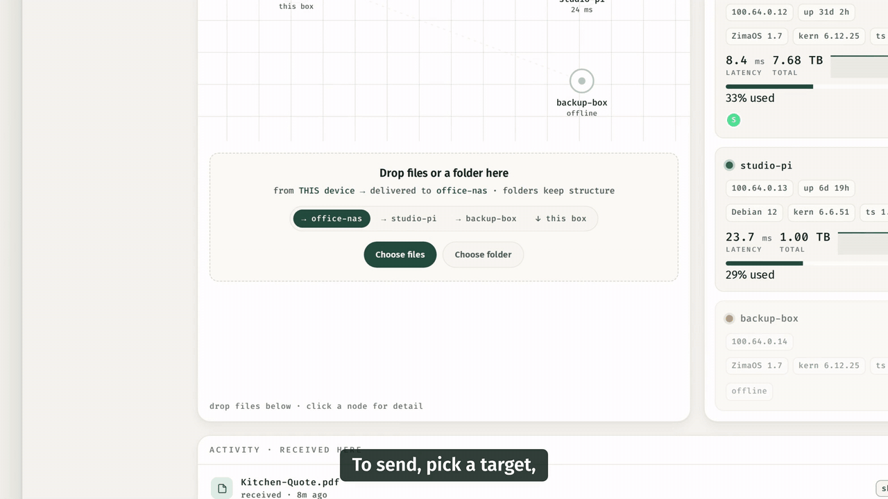

# DropBridge

A tiny drag-and-drop web UI that **streams dropped files straight to your other
ZimaOS box over the tailnet**. Unlike Taildrop it has no one-shot / size quirks:
files are streamed peer-to-peer, conflicts are auto-renamed, and everything lands
in a `/DATA` folder on the receiving box.



*Self-hosted, tailnet-native file transfer between your own machines. No cloud, no
size limits — runs on **any Linux box with Docker + Tailscale**, first-class on
ZimaOS / CasaOS (dashboard tile + data-disk picker).*

```
 ┌─ browser ─┐   drop    ┌── DropBridge (box A) ──┐   HTTPS/tailnet   ┌── DropBridge (box B) ──┐
 │  dropzone │ ────────► │ POST /api/send         │ ────────────────► │ POST /api/ingest       │
 └───────────┘           │  streams each file …   │                   │  → /DATA/dropbridge/…  │
                         └────────────────────────┘                   └────────────────────────┘
```

Each box runs the **same** container, pointed at the other.

## Configure

Copy `.env.example` → `.env` and set per box. Use the **same** `DROPBRIDGE_TOKEN`
on both. `DROPBRIDGE_PEER_URL` is the *other* node's tailnet IP:

| var | box A | box B |
|---|---|---|
| `DROPBRIDGE_NODE` | `boxA` | `boxB` |
| `DROPBRIDGE_PEER_NAME` | `boxB` | `boxA` |
| `DROPBRIDGE_PEER_URL` | `http://<boxB-tailnet-ip>:8787` | `http://<boxA-tailnet-ip>:8787` |
| `DROPBRIDGE_TOKEN` | *(shared secret)* | *(same secret)* |
| `DROPBRIDGE_FUNNEL_BASE` | `https://<boxA>.<your-tailnet>.ts.net:10000` | `https://<boxB>.<your-tailnet>.ts.net:10000` |

> Tailnet IPs are in the CGNAT range `100.64.0.0/10`; find them with `tailscale ip -4`.

## Run

```bash
export DOCKER_CONFIG=/DATA/.docker         # ZimaOS: docker config is on the RO root
mkdir -p /DATA/dropbridge/incoming
docker compose up -d --build
```

UI: `http://<box-tailnet-ip>:8787/`. For HTTPS, put it behind `tailscale serve`
on a path (so it can coexist with the ZimaOS WebUI on `/`):

```bash
sudo tailscale serve --bg --set-path=/drop http://127.0.0.1:8787
# → https://<node>.<tailnet>.ts.net/drop
```

## Networking (ZimaOS)

The shipped `docker-compose.yml` uses **`network_mode: host`**. This is deliberate:
the control-plane guard identifies a caller by its **real tailnet IP** (or a
`tailscale serve` header). A Docker bridge can rewrite the source of incoming
traffic to the bridge gateway — especially when Tailscale itself runs as a
container — so DropBridge would see the gateway instead of your `100.x` address,
`/api/mesh` would answer *"tailnet identity required"*, and the UI would drop to
demo mode. Host networking preserves the real client IP.

If Tailscale runs as the **ZimaOS App-Store app** (a container), also expose its
LocalAPI socket to the host — add a bind mount `/var/run/tailscale → /run/tailscale`
to the Tailscale app and recreate it. If `tailscaled` runs as a native host
service, it already works out of the box.

## Add nodes from your tailnet

DropBridge is multi-node: **+ add node** in the console lists your tailnet
devices (via tailscaled) and adds one as a send target. A target must run
DropBridge with the **same token** — adding probes its `/api/config` and refuses
anything that isn't DropBridge (with a clear message), so you can't add a phone
or a plain host by mistake. The peer list persists to `.dropbridge-peers.json`
in the incoming volume; the first entry is the default target and is seeded from
`DROPBRIDGE_PEER_URL` for back-compat. The drop zone's target selector lists
*this box* + every peer; remove a node from its detail panel.

## Public share links (funnel)

Each received file can be handed out to someone **not on your tailnet** via a
public, unguessable link. Click **share** on a file → DropBridge mints a
128-bit token and returns `https://<node>.<tailnet>.ts.net:10000/s/<token>`;
**copy** hands it out, **revoke** kills it, and an optional TTL expires it.

Only `GET /s/{token}` is exposed publicly — tailscale funnel is mounted
**path-scoped** to `/s`, so the UI, `/api/*`, and every other file stay
tailnet-only. Wire it up once per box:

```bash
sudo tailscale funnel --bg --https=10000 --set-path /s http://127.0.0.1:8787/s
```

and set `DROPBRIDGE_FUNNEL_BASE` to that origin (above). Funnel must be enabled
for the tailnet in the admin console. Share metadata persists to
`.dropbridge-shares.json` inside the incoming volume (survives recreate).

## Why no firewall change is needed

ZimaOS's ZFW lets the `tailscale0` interface through by default, so peer-to-peer
transfers over the tailnet work **without** opening a LAN port. You only need a
ZFW rule if you want to reach the UI from a plain-LAN device.

## Endpoints

| method | path | purpose |
|---|---|---|
| `GET` | `/` | the drop UI |
| `GET` | `/api/config` | `{node, peer, peerConfigured}` |
| `POST` | `/api/send` | multipart `files=@…` → streamed to the peer |
| `POST` | `/api/ingest` | peer→here; `X-Filename` header, bearer auth |
| `GET` | `/api/received` | list of files received on this node |
| `GET` | `/api/mesh` | live node telemetry for the console (incl. latency) |
| `GET` | `/api/download` · `POST` `/api/delete` | download-back / delete a received file |
| `POST` | `/api/share` · `GET` `/api/shares` · `POST` `/api/unshare` | mint / list / revoke a public link (tailnet-only) |
| `GET` | `/s/{token}` | **public** (funnel): serves the one shared file |
| `GET` | `/api/tailnet` | tailnet devices (from tailscaled) as add-candidates |
| `GET` | `/api/peers` · `POST` `/api/peers` · `POST` `/api/peers/remove` | list / add / remove DropBridge send targets |

## Status

Deployed on both boxes. Verified end-to-end: bidirectional transfer,
conflict-rename, bearer auth (401 on bad token), path-traversal defused, folder
drops keep structure, download-back + delete, ntfy on receive, live Mesh Console
(`/api/mesh`, real latency via HTTP-RTT fallback), and public funnel share links
(only `/s` exposed; `/api/*` returns 404 via funnel).

**Security model.** The control plane is **guard()ed** (`authTailnet`): every
state-changing / data endpoint is reachable only over the tailnet — a direct
`100.64.0.0/10` source IP, an authenticated `tailscale serve` session (the
`Tailscale-User-Login` header, trusted **only** on a loopback connection so a
LAN client on the host-exposed port can't spoof it), or the bearer token. A
public `tailscale funnel` client gets a `403`; keeping the funnel path-scoped to
`/s` remains the first line of defence. Peer-controlled strings are HTML-escaped
in the UI (no stored XSS); the bearer token is never sent to peer telemetry and
peers are restricted to tailnet CGNAT (blocks SSRF + token exfiltration); the
internal `.dropbridge-*` metadata can't be shared/served/deleted; share tokens are
128-bit `crypto/rand`; the bearer compare is timing-safe. Ingest is fail-closed
without a token, uploads honour a free-space floor and an optional
`DROPBRIDGE_MAX_BYTES` cap, and errors surface loudly (a failed transfer returns
a non-2xx, never a silent "delivered"). Reviewed iteratively — most recently a
full multi-perspective code + security audit (2026-07-07).

## Ideas / TODO

- Push prebuilt image to a registry (ghcr) for real CasaOS portability
- Encrypted backup between boxes over the tailnet (restic/borg)

## About

Built by **Holger Kuehn** (Virtual Services) — a computer scientist (**Diplom-Informatiker**,
the German master's-equivalent in CS) and career systems engineer (**VMware vExpert**,
**Microsoft Certified Professional**, **Oracle DBA**) with a long track record across
virtualization, databases and production infrastructure. DropBridge is a homelab tool built to production habits:
threat-modeled, security-reviewed across multiple independent passes, and verified
end-to-end on real hardware — not a demo.

## Colophon

DropBridge was built **AI-assisted, and deliberately so.** Every architectural
decision, the threat model, and the final on-hardware verification were mine; the AI
removed the typing between intent and result and acted as a tireless pair for review.
That's the opposite of "vibe coding" — which ships whatever a model emits, unread.
Here, only what a systems engineer stood behind, line by line and tested on real
nodes, shipped.

> A developer who refuses AI in 2026 isn't more of a craftsman — just slower.
> The craft moved up a layer: to judgment, architecture, and verification.

## License

[MIT](LICENSE) © 2026 Holger Kuehn (Virtual Services)
